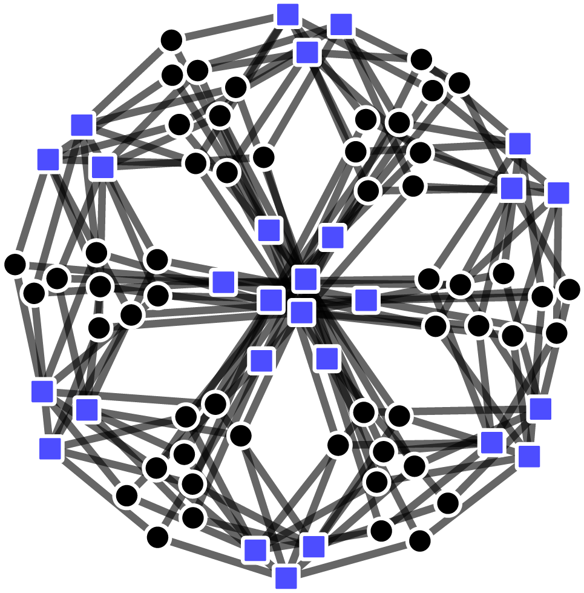
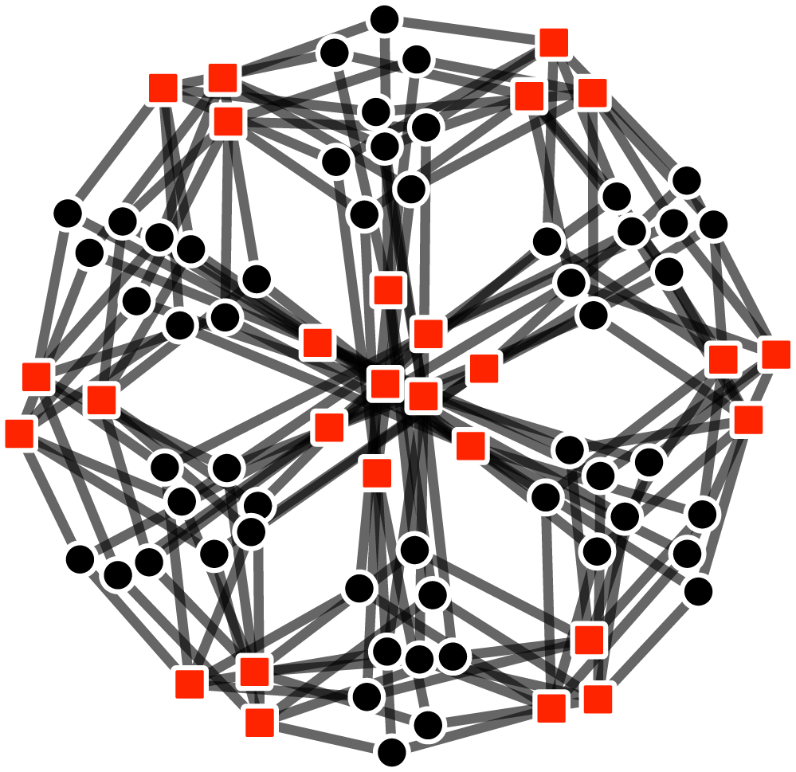
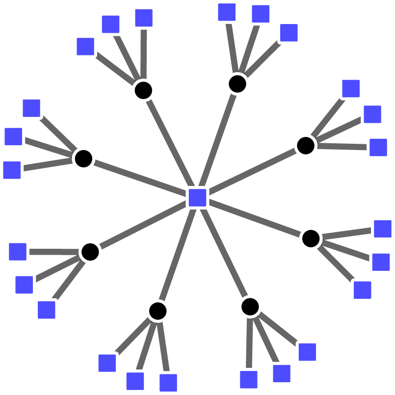
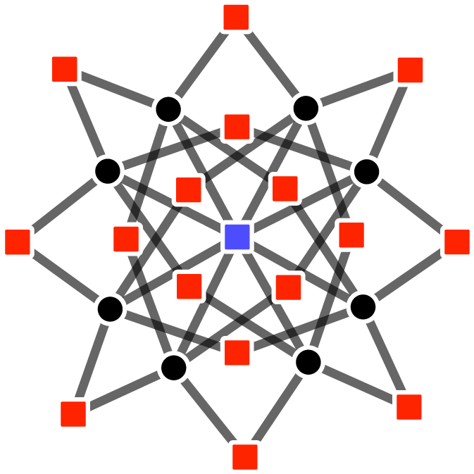
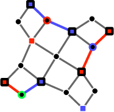

# Summary

Quantum error correcting codes (QECCs) are methods of redundantly encoding quantum states into the state of a larger quantum system in a way that provides resilience against environmental noise. These encodings are generally considered to be essential for the development of large-scale fault-tolerant quantum computers, but are also of relevance to other areas of physics such as topological phases of matter and toy models of AdS/CFT. QEsee is a web-based visualisation tool that draws graph representations of these codes. The graphs are fully interactive, allowing for the repositioning of nodes, showing/hiding of arbitrary subgraphs and visualisation of data from decoding simulations (numerical studies of how errors propagate or are corrected within the code). All images produced by QEsee can be downloaded as svg files. 

# Statement of need
The field of quantum error correction has traditionally been dominated by the study of topological codes, which have natural embeddings into n-dimensional manifolds and so are straightforward to visualise (at least for n ≤ 3). This has allowed many important results involving these codes to be obtained or informed by visual intuition (e.g. percolation theoretic proofs of thresholds, geometric proofs of possible logical operations, etc) and many of the relevant decoding algorithms are also best understood visually. In contrast, modern methods of constructing efficient QECCs are much more mathematically complex and intuition regarding their structure is much more difficult to obtain.

QEsee is designed to provide insight into the structure of non-topological codes by providing meaningful visualisations of thier Tanner graphs (although it can also be useful for visualising topological codes). Specifically, QEsee uses the force-directed graph functionality provided by D3 [@d3] to draw graphs where node positions are determined by a simple physics simulation with repulsive forces between nodes and links acting as constraints. This causes the graphs to naturally arrange themselves in minimum energy configurations that reveal information about the underlying structure of the codes. For instance, here are the $X$ and $Z$ subgraphs of a small lifted product code as drawn by QEsee

{ width=20% }
{ width=20% }

where we can see the symmetry between the $X$ and $Z$ cases, as well as how qubits and stabilisers (nodes of the graph) arrange into clusters due to the product structure. As another example, here is the full graph for the [[416,18,20]] code described in [@Roffe:2023]

![\[\[416,18,20\]\] lifted product code](figures/lp_big.png){ width=80% }

This graph has an order-13 rotational symmetry, the same order as the ring used in its construction. 

This second example also shows how the precise details of the structure can become very hard to understand if the graph is large. To help with this, QEsee allows you to hide any subset of nodes in the graph and display only those you are interested in. Here are the subgraphs showing how the support of a given $X$ stabiliser from the above code overlaps with other $X$ and $Z$ stabilisers

{ width=20% }
{ width=20% }

Visualising code structures can be useful, but often we are much more interested in how errors are propagated or corrected within a code. These questions are commonly studied numerically in decoding simulations, and QEsee also allows for visualisation of data from these simulations. Error and syndrome vectors for each timestep of the simulation can be uploaded and will be drawn on the graph, and users can then step backwards and forwards through this data to verify that their decoding algorithm is working correctly and to understand what kind of errors cause it to fail. 

{ width=20% }

The current version of QEsee can draw Tanner graphs of both CSS and non-CSS codes. Additionally, it can also draw graphs of detector error models from Stim [@Gidney:2021] (and also syndrome/correction data from simulations, as with the Tanner graph case). We note that Stim also contains the functionality to draw detector error model graphs, but these graphs are not interactive and also require the user to provide coordinate data for the nodes (and how to choose this data is non-obvious for the majority of cases). 

Finally, all images produced by QEsee can be easily downloaded as svg files, making QEsee useful for both studying codes/decoders and creating figures for publications. 

# Acknowledgements
TRS is supported by the JST Moonshot R&D Grant [grant number JPMJMS2061]. QEsee uses D3.js [@d3] for force-directed graph simulation and CSV [@csv] for parsing .csv files. Thanks to Joschka Roffe, Bohan Lu, Shin Nishio and Arthur Pesah for testing the software and providing feedback.
